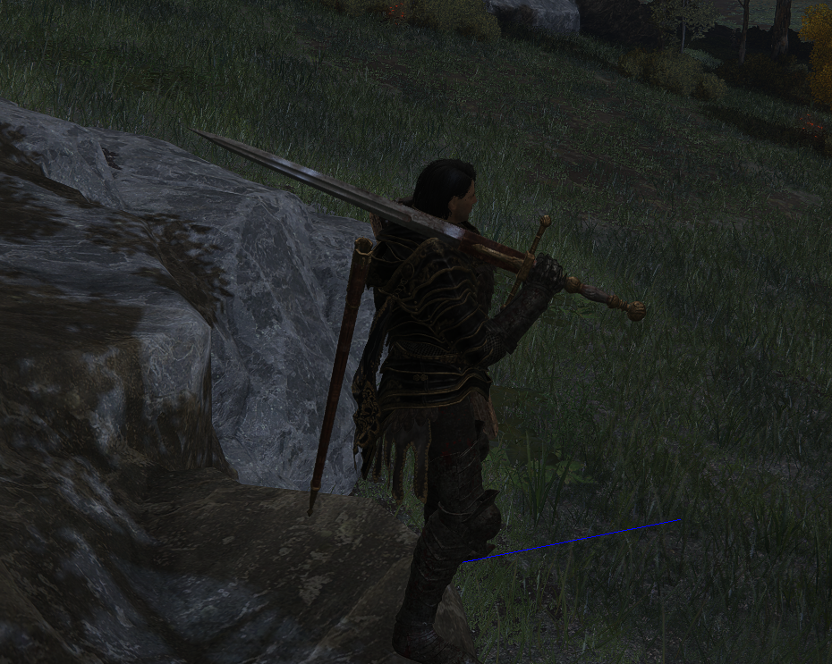

# Eldenring-rs 🔩  Elden Ring rust bindings
Rust bindings to facilitate mod creation for Elden Ring.

[](https://github.com/vswarte/eldenring-rs/actions)
[](https://crates.io/crates/eldenring)
[](https://docs.rs/eldenring)


<details>

<summary>Example mod code: render debug line</summary>

```rust
use std::time::Duration;

use eldenring::{
    cs::{CSTaskImp, RendMan, WorldChrMan},
    fd4::FD4TaskData,
    matrix::FSVector4,
    position::PositionDelta,
};
use eldenring_util::{
    ez_draw::CSEzDrawExt, singleton::get_instance, system::wait_for_system_init, task::CSTaskImpExt,
};
use nalgebra_glm as glm;

#[no_mangle]
pub unsafe extern "C" fn DllMain(_hmodule: usize, reason: u32) -> bool {
    // Check if we're attaching to the game
    if reason == 1 {
        // Kick off new thread.
        std::thread::spawn(|| {
            // Get the current program instance.
            let program = Program::current();
            // Wait for game to boot up.
            wait_for_system_init(&program, Duration::MAX).expect("Could not await system init.");

            // Retrieve games task runner.
            let cs_task = get_instance::<CSTaskImp>().unwrap().unwrap();

            // Register a new task with the game to happen every frame during the gameloops
            // ChrIns_PostPhysics phase because all the physics calculations have ran at this
            // point.
            cs_task.run_recurring(
                // The registered task will be our closure.
                |_: &FD4TaskData| {
                    // Grab the debug ez draw from RendMan if it's available. Bail otherwise.
                    let Some(ez_draw) = get_instance::<RendMan>()
                        .expect("No reflection data for RendMan")
                        .map(|r| r.debug_ez_draw.as_ref())
                    else {
                        return;
                    };

                    // Grab the main player from WorldChrMan if it's available. Bail otherwise.
                    let Some(player) = get_instance::<WorldChrMan>()
                        .expect("No reflection data for RendMan")
                        .map(|w| w.main_player.as_ref())
                        .flatten()
                    else {
                        return;
                    };

                    // Grab physics module from player.
                    let physics = &player.chr_ins.module_container.physics;

                    // Make a directional vector that points forward following the players
                    // rotation.
                    let directional_vector = {
                        let forward = glm::vec3(0.0, 0.0, -1.0);
                        glm::quat_rotate_vec3(&physics.orientation.into(), &forward)
                    };

                    // Set color for the to-be-rendered line.
                    ez_draw.set_color(&FSVector4(0.0, 0.0, 1.0, 1.0));

                    // Draw the line from the players position to a meter in front of the player.
                    ez_draw.draw_line(
                        &physics.position,
                        &(physics.position
                            + PositionDelta(
                                directional_vector.x,
                                directional_vector.y,
                                directional_vector.z,
                            )),
                    );
                },
                eldenring::cs::CSTaskGroupIndex::ChrIns_PostPhysics,
            );
        });
    }

    // Signal that DllMain executed successfully
    true
}
```

Result:


</details>

# Credits (aside listed contributors to this repository)
 - Tremwil (for the arxan code restoration disabler, vtable-rs and a few other boilerplate-y things as well as implementing the initial FD4 singleton finder for TGA that I appropriated).
 - Sfix (for coming up with the FD4 singleton finder approach at all).
 - Yui (for some structures as well as AOBs and hinting at some logic existing in the binary).

<sup><sub>(Have you contributed to TGA in some manner and does this repository have your work in it? Reach out to @chainfailure on Discord for proper credit disclosure).</sub></sup>
